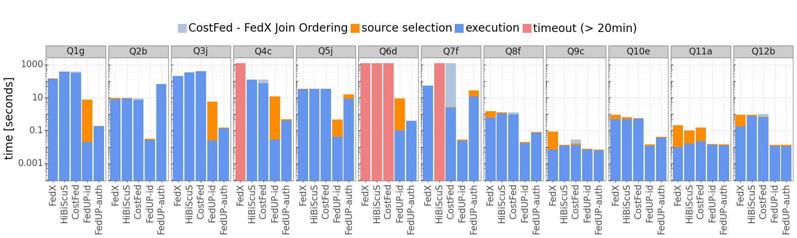
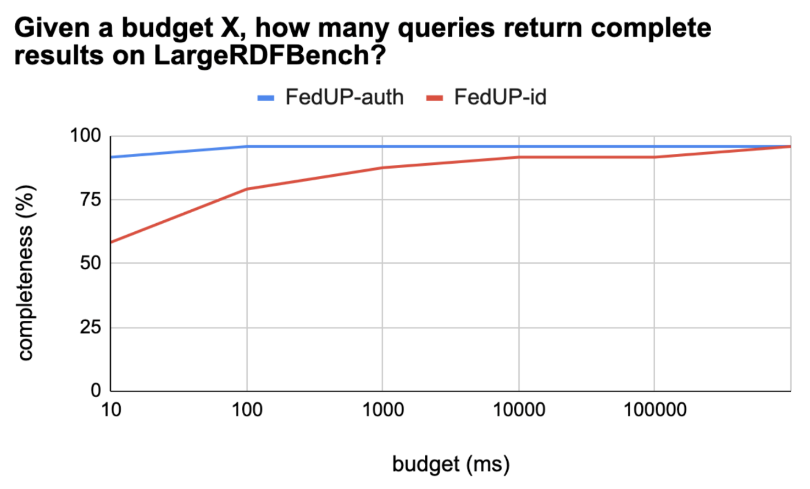
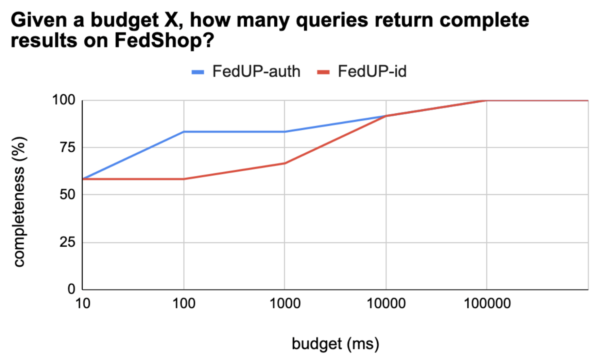

# FedUP: A Pay-as-you-go Federated SPARQL Query Engine Powered by Random Walks

## Abstract

Federated SPARQL query engines allow for the integration and querying of multiple SPARQL endpoints as if they were a single one. While federated query engines avoid moving RDF data, performance remains a critical issue that is deeply linked to minimizing the number of subqueries sent to endpoints. As this problem of source selection is NP-hard, existing federated query engines build suboptimal query plans that may significantly degrade performance.

In this paper, we propose FedUP, a federated query engine that relies on random walks to approximate source selection in a pay-as-you-go fashion. By exploring federated graphs –or their summaries–, random walks build join-aware logical plans by better capturing the relationships between sources, hence reducing the number of subqueries sent to endpoints. As many results share identical combinations of endpoints, random walks quickly converge to an accurate source selection that returns complete and correct results. Experimental studies on federated benchmarks demonstrate that FedUP outperforms state-of-the-art federated query engines regarding source selection and query execution time.

**Keywords**: Semantic Web, Federated Query Processing, Source Selection, SPARQL.

## Installation

> **Note**
> Installation instructions have only been tested on Ubuntu 20.04.6 LTS

### Dependencies

- conda
- maven
- java 11 & 20 (JDK)

### Step by step installation

- Download datasets and queries.

    ```bash
    wget https://zenodo.org/record/8096581/files/datasets.tar.gz?download=1 && tar -zxf datasets.tar.gz
    wget https://zenodo.org/record/8096581/files/queries.tar.gz?download=1 && tar -zxf queries.tar.gz
    wget https://zenodo.org/record/8096581/files/summaries.tar.gz?download=1 && tar -zxf summaries.tar.gz
    ```

- Download and install Virtuoso (Version 7.2.7). 

    ```bash
    wget https://github.com/openlink/virtuoso-opensource/releases/download/v7.2.7/virtuoso-opensource-7.2.7.tar.gz
    tar -zxf virtuoso-opensource-7.2.7.tar.gz
    cd virtuoso-opensource-7.2.7
    ./autogen.sh
    ./configure
    make && make install && make clean && make distclean
    cd ..
    ```

    > **Note**
    > If you have any problems installing Virtuoso, please refer to the Virtuoso installation instructions available [here](https://github.com/openlink/virtuoso-opensource). 

    Virtuoso will be installed in /usr/local. You can specify another directory when executing `make install`.

    ```bash
    make install prefix=/usr/local
    ```

- Update the Virtuoso configuration file.

    ```bash
    patch -u /usr/local/var/lib/virtuoso/db/virtuoso.ini -i config/virtuoso.ini.patch
    ```

- Run Virtuoso

    ```bash
    /usr/local/bin/virtuoso-t +configfile /usr/local/var/lib/virtuoso/db/virtuoso.ini # run Virtuoso in background
    ```

    Virtuoso can also be run in foreground

    ```bash
    /usr/local/bin/virtuoso-t +configfile /usr/local/var/lib/virtuoso/db/virtuoso.ini +foreground
    ```

- Load data into Virtuoso

    ```bash
    /usr/local/bin/isql "EXEC=ld_dir('`pwd`/datasets', '*.nq', 'NULL');" # assuming Virtuoso has been installed in ./virtuoso-opensource-7.2.7
    /usr/local/bin/isql "EXEC=rdf_loader_run();"
    /usr/local/bin/isql "EXEC=checkpoint;"
    ```

    You can check the `DB.DBA.load_list` table to confirm that all datasets were loaded successfully. This is indicated by an `ll_state` value of `2` and an `ll_error` value of `NULL`. More information about the loading process is available [here](https://vos.openlinksw.com/owiki/wiki/VOS/VirtBulkRDFLoader).

    ```bash
    /usr/loca/bin/isql "EXEC=select * from DB.DBA.load_list;"
    ```

    You can enumerate all named graphs using the following command for additional verification.

    ```bash
    /usr/local/bin/isql "EXEC=sparql select distinct ?g where {graph ?g {?s ?p ?o}};"
    ```

    > **Note**
    > You may have a permission denied error when loading the data into Virtuoso. You must authorize Virtuoso to access the data directory by adding the directory path to `DirsAllowed` in `/usr/local/var/lib/virtuoso/db/virtuoso.ini`.  

- Download Apache Jena (Version 4.7.0)
  
    ```bash
    wget https://archive.apache.org/dist/jena/binaries/apache-jena-4.7.0.tar.gz
    tar -zxf apache-jena-4.7.0.tar.gz
    ```

- Load summaries into Apache Jena

    ```bash
    ./apache-jena-4.7.0/bin/tdb2.xloader --loc ./summaries/largerdfbench/fedup-h0 ./summaries/largerdfbench/fedup-h0.nq
    ./apache-jena-4.7.0/bin/tdb2.xloader --loc ./summaries/largerdfbench/fedup-id ./datasets/largerdfbench.nq

    ./apache-jena-4.7.0/bin/tdb2.xloader --loc ./summaries/fedshop/fedup-h0 ./summaries/fedshop/fedup-h0.nq
    ./apache-jena-4.7.0/bin/tdb2.xloader --loc ./summaries/fedshop/fedup-id ./datasets/fedshop.nq
    ```

- Install project dependencies

    > **Warning**
    > The project uses Maven Toolchains. Make sure that the location of `java 11` and `java 20` is defined in `~/.m2/toolchains.xml`. 
  
    ```bash
    conda env create -f environment.yaml
    conda activate fedupxp

    mvn clean install
    ```

## Usage

### Generate summaries

- To create a `fedup` summary from a `.nq`:

    ```bash
    mvn exec:java -Dexec.mainClass="fr.univnantes.gdd.fedup.startup.GenerateSummaries" -Dexec.args="fedup -d <input> -o <output> -m <modulo>" -pl fedup
    ```

    > Entites (IRIs) are transformed as follows: https://dbpedia.org/page/France => https://dbpedia.org/ + hash(page/France) % m
    
    > Predicates remain unchanged
    
    > Literals are transformed as follows: "France" => "Any"

- To transform a SPARQL query Q into a SPARQL query Q' that can be executed on a `fedup` summary:

    ```bash
    mvn exec:java -Dexec.mainClass="fr.univnantes.gdd.fedup.startup.GenerateSummaries" -Dexec.args="fedup -f <input> -o <output> -m <modulo>" -pl fedup
    ```

- To create a `HiBiSCuS` summary from a federation:
  
    ```bash
    mvn exec:java -Dexec.mainClass="fr.univnantes.gdd.fedup.startup.GenerateSummaries" -Dexec.args="hibiscus -e <endpoints> -o <output>" -pl fedup
    ```

    > More information about HiBiSCuS summaries [here](https://2014.eswc-conferences.org/sites/default/files/papers/paper_50.pdf).

- To create a `CostFed` summary from a federation:

    ```bash
    mvn exec:java -Dexec.mainClass="fr.univnantes.gdd.fedup.startup.GenerateSummaries" -Dexec.args="costfed -e <endpoints> -o <output> -b <branchingFactor>" -pl fedup
    ```

    > More information about CostFed summaries [here](https://svn.aksw.org/papers/2018/SEMANTICS_CostFed/public.pdf).

### Run Experiments

```bash
snakemake -C virtuoso=/usr/local run="[1,2,3]" workload="[largerdfbench,fedshop]" approach="[fedup-id,fedup-h0,fedx,hibiscus-index,costfed-index,costfed-noopt]" -c1
```

It is possible to run a specific query, e.g., query Q1g of FedShop using fedup-h0.

```bash
snakemake -C virtuoso=/usr/local -c1 output/fedshop/fedup-h0/Q1g.1.csv
```

## Dataset and Queries

In our paper, we use [LargeRDFBench](https://github.com/dice-group/LargeRDFBench) and [FedShop](https://github.com/MaastrichtU-IDS/federatedQueryKG/blob/main/usecaseFedShop.md) to compare FedUP with state-of-the-art federated query engines. LargeRDFBench is the most commonly used benchmark to evaluate the performance of federated query engines. FedShop is a new benchmark introduced at the *Hackathon on Querying Federations of Knowledge Graphs*. It relies on the [Berlin SPARQL Benchmark (BSBM)](http://wbsg.informatik.uni-mannheim.de/bizer/berlinsparqlbenchmark/) and provides two configurations: one with 20 federation members, another with 100 federation members. We use the second configuration, denoted batch4 in the provided Drive folder.

Original LargeRDFBench queries and datasets ara available [here](https://github.com/dice-group/LargeRDFBench), while FedShop queries and data can be found [here](https://github.com/MaastrichtU-IDS/federatedQueryKG/blob/main/usecaseFedShop.md). Datasets need to be cleaned to be injested into Jena. To make things easier, we provide the cleaned datasets for LargeRDFBench and FedShop [here](https://zenodo.org/record/8096581). However, for the sake of transparency, the procedure for cleaning the data is described below:

1. Download all datasets (`.nt` files) and merge them into a `.nq` file. Each triple (s, p, o) from an RDF graph G are transformed into a quad (s, p, o, <http://example.com/G>).
2. Use the `riot` command from Apache Jena to clean the `.nq` file (`riot --check --strict <input> > <output>`).

## Experimental Results

### Average performance achieved by FedX, HiBiScuS, CostFed, and FedUP on LargeRDFBench queries.


### Average performance achieved by FedX, HiBiScuS, CostFed, and FedUP on FedShop queries for the 100 endpoints use-case.



### How much budget do we need to get complete results?



