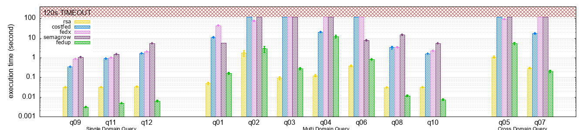
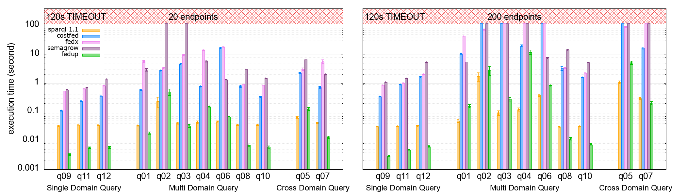

# FedUP: Querying Large-Scale Federations of SPARQL Endpoints

## Abstract

Processing SPARQL queries over large federations of SPARQL endpoints is crucial for keeping the Semantic Web decentralized. Despite the existence of hundreds of SPARQL endpoints, current federation engines only scale to dozens. One major issue comes from the current definition of the source selection problem, i.e., finding the minimal set of SPARQL endpoints to contact per triple pattern. Even if such a source selection is minimal, only a few combinations of sources may return results. Consequently, most of the query processing time is wasted evaluating combinations that return no results. In this paper, we introduce the concept of *Result-Aware* query plans. This concept ensures that every sub-query of the query plan effectively contributes to the result of the query. To compute a *Result-Aware* query plan, we propose *FedUP*, a new federation engine able to produce *Result-Aware* query plans by tracking the provenance of query results. However, getting query results requires computing source selection, and computing source selection requires query results. To break this vicious cycle, *FedUP* computes results and provenances on tiny quotient summaries of federations at the cost of source selection accuracy. Experimental results on federated benchmarks demonstrate that *FedUP* outperforms state-of-the-art federation engines by orders of magnitude in the context of large-scale federations.

**Keywords**: Semantic Web, Federated Query Processing, Source Selection, SPARQL.

## Installation

> **Note**
> Installation instructions have only been tested on Ubuntu 20.04.6 LTS

### Dependencies

- conda
- maven
- java 11 & 20 (JDK)

### QuickStart

```bash
    git clone git@github.com:GDD-Nantes/FedUP-experiments.git
    cd FedUP-experiments
    
    conda env create -f environment.yaml
    conda activate fedupxp
    
    snakemake -c1 -R run_xp
```

## Experimental Results

Experimental results and plot scripts are available in the [results](https://github.com/GDD-Nantes/FedUP-experiments/tree/ask_issue%232/results) directory.





[//]: # (### Step-by-step installation)

[//]: # ()
[//]: # (- Download datasets and queries.)

[//]: # ()
[//]: # (    ```bash)

[//]: # (    wget https://zenodo.org/record/8096581/files/datasets.tar.gz?download=1 && tar -zxf datasets.tar.gz)

[//]: # (    wget https://zenodo.org/record/8096581/files/queries.tar.gz?download=1 && tar -zxf queries.tar.gz)

[//]: # (    wget https://zenodo.org/record/8096581/files/summaries.tar.gz?download=1 && tar -zxf summaries.tar.gz)

[//]: # (    ```)

[//]: # ()
[//]: # (- Download and install Virtuoso &#40;Version 7.2.7&#41;. )

[//]: # ()
[//]: # (    ```bash)

[//]: # (    wget https://github.com/openlink/virtuoso-opensource/releases/download/v7.2.7/virtuoso-opensource-7.2.7.tar.gz)

[//]: # (    tar -zxf virtuoso-opensource-7.2.7.tar.gz)

[//]: # (    cd virtuoso-opensource-7.2.7)

[//]: # (    ./autogen.sh)

[//]: # (    ./configure)

[//]: # (    make && make install && make clean && make distclean)

[//]: # (    cd ..)

[//]: # (    ```)

[//]: # ()
[//]: # (    > **Note**)

[//]: # (    > If you have any problems installing Virtuoso, please refer to the Virtuoso installation instructions available [here]&#40;https://github.com/openlink/virtuoso-opensource&#41;. )

[//]: # ()
[//]: # (    Virtuoso will be installed in /usr/local. You can specify another directory when executing `make install`.)

[//]: # ()
[//]: # (    ```bash)

[//]: # (    make install prefix=/usr/local)

[//]: # (    ```)

[//]: # ()
[//]: # (- Update the Virtuoso configuration file.)

[//]: # ()
[//]: # (    ```bash)

[//]: # (    patch -u /usr/local/var/lib/virtuoso/db/virtuoso.ini -i config/virtuoso.ini.patch)

[//]: # (    ```)

[//]: # ()
[//]: # (- Run Virtuoso)

[//]: # ()
[//]: # (    ```bash)

[//]: # (    /usr/local/bin/virtuoso-t +configfile /usr/local/var/lib/virtuoso/db/virtuoso.ini # run Virtuoso in background)

[//]: # (    ```)

[//]: # ()
[//]: # (    Virtuoso can also be run in foreground)

[//]: # ()
[//]: # (    ```bash)

[//]: # (    /usr/local/bin/virtuoso-t +configfile /usr/local/var/lib/virtuoso/db/virtuoso.ini +foreground)

[//]: # (    ```)

[//]: # ()
[//]: # (- Load data into Virtuoso)

[//]: # ()
[//]: # (    ```bash)

[//]: # (    /usr/local/bin/isql "EXEC=ld_dir&#40;'`pwd`/datasets', '*.nq', 'NULL'&#41;;" # assuming Virtuoso has been installed in ./virtuoso-opensource-7.2.7)

[//]: # (    /usr/local/bin/isql "EXEC=rdf_loader_run&#40;&#41;;")

[//]: # (    /usr/local/bin/isql "EXEC=checkpoint;")

[//]: # (    ```)

[//]: # ()
[//]: # (    You can check the `DB.DBA.load_list` table to confirm that all datasets were loaded successfully. This is indicated by an `ll_state` value of `2` and an `ll_error` value of `NULL`. More information about the loading process is available [here]&#40;https://vos.openlinksw.com/owiki/wiki/VOS/VirtBulkRDFLoader&#41;.)

[//]: # ()
[//]: # (    ```bash)

[//]: # (    /usr/loca/bin/isql "EXEC=select * from DB.DBA.load_list;")

[//]: # (    ```)

[//]: # ()
[//]: # (    You can enumerate all named graphs using the following command for additional verification.)

[//]: # ()
[//]: # (    ```bash)

[//]: # (    /usr/local/bin/isql "EXEC=sparql select distinct ?g where {graph ?g {?s ?p ?o}};")

[//]: # (    ```)

[//]: # ()
[//]: # (    > **Note**)

[//]: # (    > You may have a permission denied error when loading the data into Virtuoso. You must authorize Virtuoso to access the data directory by adding the directory path to `DirsAllowed` in `/usr/local/var/lib/virtuoso/db/virtuoso.ini`.  )

[//]: # ()
[//]: # (- Download Apache Jena &#40;Version 4.7.0&#41;)

[//]: # (  )
[//]: # (    ```bash)

[//]: # (    wget https://archive.apache.org/dist/jena/binaries/apache-jena-4.7.0.tar.gz)

[//]: # (    tar -zxf apache-jena-4.7.0.tar.gz)

[//]: # (    ```)

[//]: # ()
[//]: # (- Load summaries into Apache Jena)

[//]: # ()
[//]: # (    ```bash)

[//]: # (    ./apache-jena-4.7.0/bin/tdb2.xloader --loc ./summaries/largerdfbench/fedup-h0 ./summaries/largerdfbench/fedup-h0.nq)

[//]: # (    ./apache-jena-4.7.0/bin/tdb2.xloader --loc ./summaries/largerdfbench/fedup-id ./datasets/largerdfbench.nq)

[//]: # ()
[//]: # (    ./apache-jena-4.7.0/bin/tdb2.xloader --loc ./summaries/fedshop/fedup-h0 ./summaries/fedshop/fedup-h0.nq)

[//]: # (    ./apache-jena-4.7.0/bin/tdb2.xloader --loc ./summaries/fedshop/fedup-id ./datasets/fedshop.nq)

[//]: # (    ```)

[//]: # ()
[//]: # (- Install project dependencies)

[//]: # ()
[//]: # (    > **Warning**)

[//]: # (    > The project uses Maven Toolchains. Make sure that the location of `java 11` and `java 20` is defined in `~/.m2/toolchains.xml`. )

[//]: # (  )
[//]: # (    ```bash)

[//]: # (    conda env create -f environment.yaml)

[//]: # (    conda activate fedupxp)

[//]: # ()
[//]: # (    mvn clean install)

[//]: # (    ```)

[//]: # ()
[//]: # (## Usage)

[//]: # ()
[//]: # (### Generate summaries)

[//]: # ()
[//]: # (- To create a `fedup` summary from a `.nq`:)

[//]: # ()
[//]: # (    ```bash)

[//]: # (    mvn exec:java -Dexec.mainClass="fr.univnantes.gdd.fedup.startup.GenerateSummaries" -Dexec.args="fedup -d <input> -o <output> -m <modulo>" -pl fedup)

[//]: # (    ```)

[//]: # ()
[//]: # (    > Entities &#40;IRIs&#41; are transformed as follows: https://dbpedia.org/page/France => https://dbpedia.org/ + hash&#40;page/France&#41; % m)

[//]: # (    )
[//]: # (    > Predicates remain unchanged)

[//]: # (    )
[//]: # (    > Literals are transformed as follows: "France" => "Any")

[//]: # ()
[//]: # (- To transform a SPARQL query Q into a SPARQL query Q' that can be executed on a `fedup` summary:)

[//]: # ()
[//]: # (    ```bash)

[//]: # (    mvn exec:java -Dexec.mainClass="fr.univnantes.gdd.fedup.startup.GenerateSummaries" -Dexec.args="fedup -f <input> -o <output> -m <modulo>" -pl fedup)

[//]: # (    ```)

[//]: # ()
[//]: # (- To create a `HiBiSCuS` summary from a federation:)

[//]: # (  )
[//]: # (    ```bash)

[//]: # (    mvn exec:java -Dexec.mainClass="fr.univnantes.gdd.fedup.startup.GenerateSummaries" -Dexec.args="hibiscus -e <endpoints> -o <output>" -pl fedup)

[//]: # (    ```)

[//]: # ()
[//]: # (    > More information about HiBiSCuS summaries [here]&#40;https://2014.eswc-conferences.org/sites/default/files/papers/paper_50.pdf&#41;.)

[//]: # ()
[//]: # (- To create a `CostFed` summary from a federation:)

[//]: # ()
[//]: # (    ```bash)

[//]: # (    mvn exec:java -Dexec.mainClass="fr.univnantes.gdd.fedup.startup.GenerateSummaries" -Dexec.args="costfed -e <endpoints> -o <output> -b <branchingFactor>" -pl fedup)

[//]: # (    ```)

[//]: # ()
[//]: # (    > More information about CostFed summaries [here]&#40;https://svn.aksw.org/papers/2018/SEMANTICS_CostFed/public.pdf&#41;.)

[//]: # ()
[//]: # (### Run Experiments)

[//]: # ()
[//]: # (```bash)

[//]: # (snakemake -C virtuoso=/usr/local run="[1,2,3]" workload="[largerdfbench,fedshop]" approach="[fedup-id,fedup-h0,fedx,hibiscus-index,costfed-index,costfed-noopt]" -c1)

[//]: # (```)

[//]: # ()
[//]: # (It is possible to run a specific query, e.g., query Q1g of FedShop using fedup-h0.)

[//]: # ()
[//]: # (```bash)

[//]: # (snakemake -C virtuoso=/usr/local -c1 output/fedshop/fedup-h0/Q1g.1.csv)

[//]: # (```)

[//]: # ()
[//]: # (## Dataset and Queries)

[//]: # ()
[//]: # (In our paper, we use [LargeRDFBench]&#40;https://github.com/dice-group/LargeRDFBench&#41; and [FedShop]&#40;https://github.com/GDD-Nantes/FedShop&#41; to compare FedUP with state-of-the-art federation engines. LargeRDFBench is the most commonly used benchmark to evaluate the performance of federation engines. FedShop is a new benchmark to test the scalability of federation engines.)

[//]: # ()
[//]: # (LargeRDFBench and FedShop queries are available in the [queries]&#40;https://github.com/GDD-Nantes/FedUP-experiments/tree/ask_issue%232/queries&#41; directory, while datasets are available [online]&#40;https://drive.google.com/file/d/1Q4ZwiwTRzRvj9m3jZN-w3R9MIi0xvLGm/view?usp=share_link&#41;.)

[//]: # ()
[//]: # (## Experimental Results)

