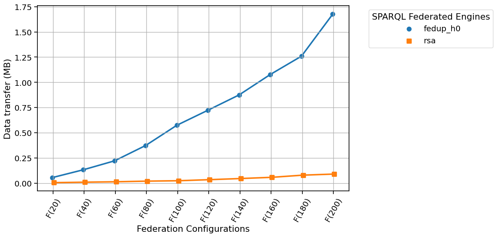

# fedup-experiments

FedUP is a SPARQL federation engine that builds logical plans based on
*Result-Aware* source selection. These plans looks like
unions-over-joins trees while state-of-the-art engines builds
joins-over-unions trees [1]. This project aims to evaluate the impact of
such a shift on two benchmarks: 

- [X] The traditional LargeRDFBench benchmark [2] that comprises a dozen
      of endpoints.
- [X] The new FedShop benchmark [3] that emulates an e-commerce
      application that scales up to 200 endpoints.

## Installation

> **Note**
> Installation instructions have only been tested on Ubuntu 20.04.6 LTS

> **Dependencies**
> conda, maven, java 11 & 20 (JDK)

### QuickStart

```bash
git clone git@github.com:GDD-Nantes/FedUP-experiments.git
cd FedUP-experiments
    
conda env create -f environment.yaml
conda activate fedupxp
    
snakemake -c1 -R run_xp
```

## Experimental Results

Experimental results and plot scripts are available in the
[results](https://github.com/GDD-Nantes/FedUP-experiments/tree/main/results)
directory. Detailed interpretations are available in the article.


## Supplementary materials

All measurements for
[LargeRDFBench](results/results_largerdfbench.csv) and [FedShop on
batches 0 and 9](results/results_fedshop.csv) are available.

### Source selection times

Source selection times of LargeRDFBench and FedShop queries on a
logarithmic scale. Execution times and source selection times cannot
coexist on the same stacked bar chart as the logarithmic scale
misleads the reader to think that either source selection times do not
exist (when they are on top), or they are very important (when they
are at the bottom).

> **Careful**
> The scale of execution times goes down to 0.001 while this scale for source selection times goes down to 0.0001.


### FedShop: FedUP vs RSA
- Figure 1: Engines execution time (ms) when the federation grows.


- Figure 2: Source selection time (ms) when the federation grows (RSA has no source-selection time as the source selection is pre-computed)


- Figure 3: Data Transfer (MB) when the federation grows


- Figure 4: FedUP performance (all metrics) when the federation grows, compared to SoTA engines.
It's worth noting that any metric column should be interpreted within the context of "status_timeout" and "status_error".
For example, for CostFed the data transfer appears to "diminish" as federation size grows because the timeout rate increases.


## References

[1] Sijin Cheng and Olaf Hartig. __FedQPL: A language for logical
query plans over heterogeneous federations of RDF data sources.__ In
the 22nd International Conference on Information Integration and
Web-Based Applications & Services. 2021.

[2] Michael Schmidt,Olaf Görlitz,Peter Haase,Günter Ladwig, Andreas
Schwarte, and Thanh Tran. __FedBench: A benchmark suite for federated
semantic data query processing.__ In 10th International Semantic Web
Conference (ISWC). 2011

[3] Minh-Hoang Dang, Julien Aimonier-Davat, Pascal Molli, Olaf Hartig,
Hala Skaf-Molli, and Yotlan Le Crom. __FedShop: A benchmark for
testing the scalability of SPARQL federation engines.__ In
International Semantic Web Conference (ISWC). 2023.
